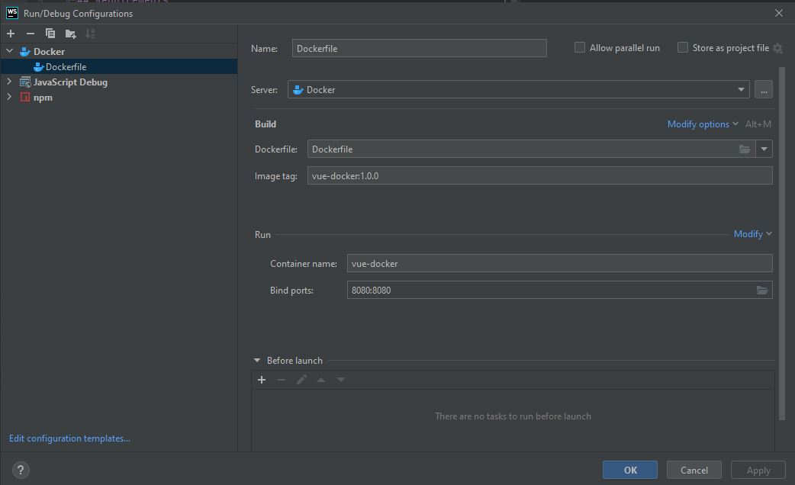
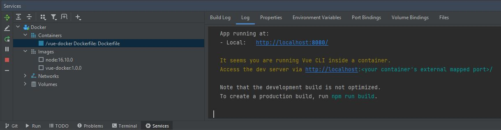
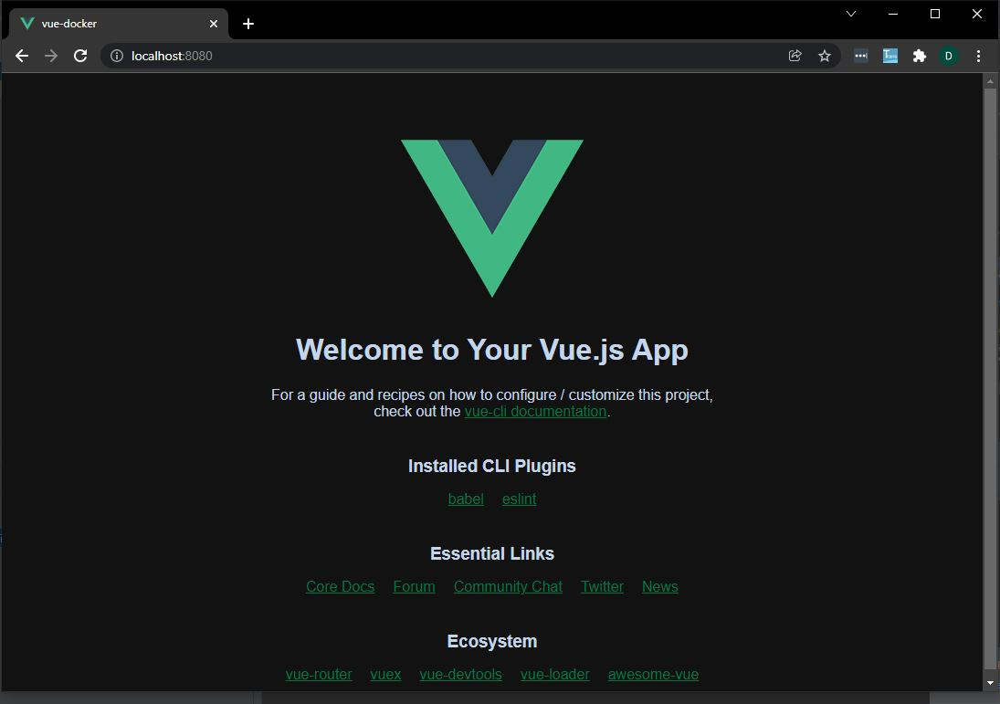

# vue-docker

This project shows how to dockerize web application build using Vue JS web development framework for Java Script programming language.

## Requirements

1. WebStorm IDE - you need to install WebStorm on your Windows machine
2. Docker Desktop - you need to install Docker Desktop for Windows
3. NodeJS Service - you need to install Node.JS ver 16.10.0
4. NodeJS Image - you need to pull node:16.10.0 image from Docker Hub

### Edit Configuration

On WebStorm toolbar 'Edit Configuration' choose Docker > Dockerfile, and fill in below:

### Run Docker

And then Run 'Dockerfile' configuration, on 'Service' tab you'll see new container created

### Test on Browser

The Vue application will run on your http://localhost:8080

